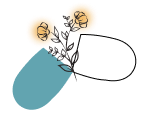

<p align="center">
  
</p>

<h1 align="center">🌼 Pilly 🌼</h1>

<p align="center">
  <b>Aplicativo mobile de monitoramento e gerenciamento de medicações</b><br/>
  Nunca mais esqueça de tomar seu remédio.
</p>

<p align="center">
  
  
  
  
</p>

---

## 📋 Sobre o Projeto

O **Pilly** é um aplicativo mobile desenvolvido para ajudar usuários a gerenciar seus medicamentos de forma prática e organizada. O app permite cadastrar remédios, configurar alarmes para horários de medicação, monitorar o estoque de medicamentos e localizar farmácias próximas.

O projeto é desenvolvido como trabalho acadêmico na **Universidade de Passo Fundo (UPF)**.

### O problema

Muitas pessoas — especialmente idosos, cuidadores e pessoas com tratamentos contínuos — esquecem de tomar medicamentos no horário correto ou não percebem quando o estoque está acabando. Isso pode comprometer tratamentos e a saúde.

### A solução

O Pilly centraliza o controle de medicações em um app simples e intuitivo, com notificações inteligentes, suporte a múltiplos perfis (ex: cuidadores que gerenciam medicações de familiares, clínicas veterinárias, hospitais, etc...) e alerta de estoque baixo.

---

## ✨ Funcionalidades

- **Acesso rápido** — Use o app sem precisar de cadastro para funcionalidades básicas
- **Cadastro e login** — Crie uma conta para salvar seus dados entre sessões
- **CRUD de medicamentos** — Cadastre, visualize, edite e exclua remédios
- **Múltiplos perfis** — Gerencie medicações de diferentes pessoas (ex: filhos, pais)
- **Alarmes e notificações** — Receba lembretes no horário programado para cada medicação
- **Alerta de estoque baixo** — Seja notificado quando um medicamento atingir menos de 10% da quantidade original
- **Mapa de farmácias** — Localize farmácias próximas com integração ao Google Maps
- **Configurações flexíveis** — Personalize notificações (push e/ou WhatsApp)

---

## 📱 Telas do App

<p align="center">
  
  
  
  
</p>

<p align="center">
  
  
  
  
</p>

> As imagens acima são do protótipo de alta fidelidade.

---

## 🏗️ Arquitetura

O sistema utiliza uma arquitetura **cliente-servidor**:

```
┌──────────────────┐         HTTP/REST         ┌──────────────────┐
│                  │  ◄───────────────────────► │                  │
│   App Mobile     │                            │   Backend API    │
│   (React Native) │                            │   (Node.js)      │
│                  │                            │                  │
└──────────────────┘                            └────────┬─────────┘
                                                         │
                                                         ▼
                                                ┌──────────────────┐
                                                │   Banco de Dados │
                                                │   (PostgreSQL)   │
                                                └──────────────────┘
```

---

## 🗃️ Modelo de Dados

| Entidade           | Descrição                                              |
|--------------------|--------------------------------------------------------|
| **Usuario**        | Dados de autenticação e perfil do usuário               |
| **Perfil_Remedio** | Perfis de pessoas vinculadas ao usuário (ex: familiares)|
| **Remedio**        | Informações do medicamento (nome, dosagem, quantidade)  |
| **Tipo_Remedio**   | Classificação do remédio (cápsula, líquido, etc.)       |
| **Frequencia**     | Horários e periodicidade de cada medicação              |
| **Farmacia**       | Dados e coordenadas das farmácias (gerenciado por admin)|

---

## 🚀 Como Rodar o Projeto

### Pré-requisitos

- [Node.js](https://nodejs.org/) (v18+)
- [Expo CLI](https://docs.expo.dev/get-started/installation/)
- [Git](https://git-scm.com/)

### Instalação

```bash
# Clone o repositório
git clone https://github.com/DyeniferFrazao/Pilly.git
cd Pilly

# Instale as dependências
npm install

# Inicie o app com Expo
npx expo start
```

### Rodando no dispositivo

- **Android**: Escaneie o QR Code com o app [Expo Go](https://expo.dev/go)
- **iOS**: Escaneie o QR Code com a câmera do iPhone (requer Expo Go instalado)

### Backend (se aplicável)

```bash
cd backend
npm install
npm run dev
```

> ⚠️ Configure as variáveis de ambiente em um arquivo `.env` antes de iniciar o backend.

---

## 🛠️ Tecnologias

| Tecnologia         | Uso                                        |
|--------------------|--------------------------------------------|
| React Native       | Desenvolvimento mobile multiplataforma     |
| Expo               | Build, execução e testes do app             |
| Node.js            | Backend e API REST                         |
| PostgreSQL         | Banco de dados relacional                  |
| Google Maps API    | Localização de farmácias no mapa           |
| GitHub             | Controle de versão e colaboração           |

---

## 📂 Estrutura do Projeto

```
Pilly/
├── assets/              # Ícones, imagens e logo
├── src/
│   ├── components/      # Componentes reutilizáveis
│   ├── screens/         # Telas do app
│   ├── services/        # Chamadas à API
│   ├── utils/           # Funções auxiliares
│   └── navigation/      # Configuração de rotas
├── backend/             # API Node.js (se monorepo)
├── docs/                # Documentação e screenshots
│   ├── DVP.pdf          # Documento de Visão do Produto
│   └── screenshots/     # Prints das telas
├── App.js               # Ponto de entrada
├── package.json
└── README.md
```

---

## 📅 Cronograma

| Data       | Entrega                                       |
|------------|-----------------------------------------------|
| 19/04/2026 | Configuração do ambiente e preparação          |
| 26/04/2026 | Adaptação da aplicação para iOS                |
| 03/05/2026 | Integração frontend ↔ backend                  |
| 11/05/2026 | Testes das funcionalidades principais          |
| 17/05/2026 | Funcionalidades adicionais e segurança         |
| 24/05/2026 | Funcionalidades adicionais e segurança         |
| 01–15/06   | Correções e refinamentos                       |
| 22/06/2026 | 🎯 Entrega da versão final e documentação      |

---

## 👩‍💻 Autora

**Dyênifer Thaís Frazão**  
Universidade de Passo Fundo – UPF  
📧 209933@upf.br

---

## 📄 Licença

Este projeto é desenvolvido para fins acadêmicos. Entre em contato com a autora para informações sobre uso e distribuição.

---

<p align="center">
  Feito com 💙 em Passo Fundo/RS
</p>
